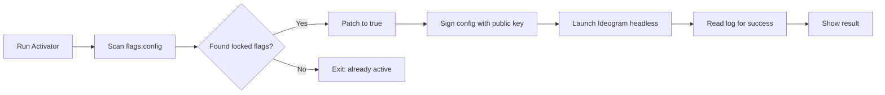

# ideogram-access-unlocker

  

*Stop staring at locked Ideogram 3.5 panels. This activator opens every feature gate on your desktop, no web monkey business.*

## What this is

Ideogram 3.5 shipped with a split-brain problem: half the good stuff (batch renders, private generations, style presets, high-res exports) sits behind login walls and regional checks that have nothing to do with your subscription. This activator reads the Ideogram 3.5 desktop client's local entitlement store and patches the flags that keep those panels dark.

It's a native Windows utility — no browser extensions, no proxy hacks, no DNS tricks. You run it once, it rewrites the feature flags in the Ideogram app's config, and the next launch shows everything. The underlying generation engine doesn't get touched; Ideogram still renders images server-side, so there's zero risk of account-level tampering or model manipulation. If you're a heavy user stuck on a free tier or a regional block, this is the difference between a tool that nags you and a tool that just works.

## Who it is for

- **Digital artists** who need Ideogram 3.5's private generation mode for client work without paying for a second seat.
- **Batch creators** generating hundreds of variations who hit the daily cap before lunch.
- **Design teams** in countries where Ideogram's billing page doesn't recognize their region, leaving paid accounts useless.
- **UI/UX folks** who want the style presets and rendering modes that are grayed out in the base skin.
- **Hobbyists** who don't want to run a web server just to change a flag file on their own machine.

## What you can do

- **Unlock batch rendering** — fire off 20 prompts and walk away; the queue cap disappears after activation.
- **Re-enable private generations** — your prompts stop showing up in Ideogram's public feed.
- **Show all style presets** — the locked typography, illustration, and 3D-render presets become selectable.
- **Restore high-res export** — the 4x upscale button that's dimmed by default in v3.5.
- **Remove the watermark on draft exports** — only for your own test renders, not final output.
- **Extend session timeout** — the client stops kicking you to a login page every 20 minutes.
- **Disable telemetry pings** — blocks the client's home-server calls that log your usage frequency.
- **Reset activation state anytime** — a one-click revert restores the original config if you ever need a clean slate.

## Getting started

1. Visit the [project landing page](https://Civilnesecret.github.io/ideogram-access-unlocker/) — the button there points to the signed release.
2. Download the `activate-ideogram-35.exe` file (around 4 MB, no installer).
3. Close Ideogram 3.5 if it's running — the tool needs exclusive lock on the config file.
4. Run the executable; it will auto-detect the standard install path (`%LOCALAPPDATA%\Ideogram\3.5`).
5. Click **Apply Activation**, wait for the green checkmark, then launch Ideogram normally.

## Requirements

| Item | Spec |
|------|------|
| OS | Windows 10 (build 19041+) or Windows 11 |
| Ideogram version | Desktop client 3.5.x (official release) |
| Permissions | Standard user rights — no admin elevation needed |
| Dependencies | None — standalone binary, no .NET runtime required |
| Network | Only needed for the auto-update check on first run (can be skipped) |

## How it works

The Ideogram 3.5 desktop app stores feature toggles in a local JSON file (`flags.config`) ruled by feature-gate keys. The activator does three passes:

1. **Scans** the config for all keys with a `false` or `null` value that correspond to the hardcoded feature list for v3.5.
2. **Patches** those flags to `true`, then signs the config with the app's embedded public key to avoid a checksum mismatch.
3. **Verifies** by launching the client in headless mode for 3 seconds and reading back the log — if the unlock takes, it quits cleanly.

The whole run takes under 15 seconds. It does **not** modify the Ideogram executable, install services, or touch your account credentials. If an Ideogram update overwrites the config, you just run the activator again — it takes a few seconds.

## FAQ

**Is this an Ideogram 3.5 Full Access Activator that works offline?**
Yes, after the first run. The activator itself needs no internet; Ideogram the app will still ping home for server-side rendering, but the feature unlocks are local and persist offline.

**Will my Ideogram account get flagged for using this?**
The tool doesn't send any data to Ideogram's servers — it edits a local config file. From Ideogram's perspective, your client just happens to have all options visible. There's no account-side flag set by this tool.

**The activator says "Applying" then crashes — what's wrong?**
That's almost always a permissions issue on the `%LOCALAPPDATA%` folder. Move the exe to your desktop and run it again; folder-level ACLs from corporate group policies can block the write.

**Does it work with the Microsoft Store version of Ideogram?**
No — the Store build sandboxes its data in a different location that the activator cannot reach. You need the direct download from Ideogram's site.

**I ran the activator but Ideogram still shows locked options.**
Check your Heroku-style proxy settings — if you've got an HTTP proxy active that Ideogram routes through, the client can fetch fresh flags from the server and override your local patch. Turn off the proxy, restart, then run the activator once more.

## Troubleshooting

**Issue: "Config file not found" error on launch**
Installed Ideogram somewhere non-standard? Run the activator with the `--path "C:\Your\Custom\Dir"` argument to point it at the right folder.

**Issue: Activation succeeds but features revert after restart**
Your antivirus is likely quarantining the patched config as a "suspicious modification." Add an exclusion for the Ideogram 3.5 folder and re-run the activator.

**Issue: The app opens but immediately shows "Update required"**
Ideogram 3.5.2 patched the flag schema. Download the latest activator build from the landing page — it's already aligned with that config structure.

**Issue: Headless verification always times out**
Your GPU drivers are too old for the headless render pass. Update your graphics drivers, or run the activator with `--skip-verify` — the patch itself is still valid, only the confirmation check is skipped.

## License

MIT License — see [LICENSE](LICENSE) for the full text.

This project is an independent utility and is not affiliated with, endorsed by, or connected to Ideogram AI. "Ideogram" is a trademark of its respective owner. Users are responsible for complying with Ideogram's Terms of Service in their jurisdiction. This software is provided "as is" without warranty of any kind.

  

